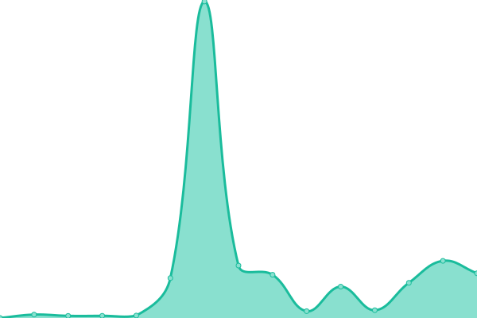
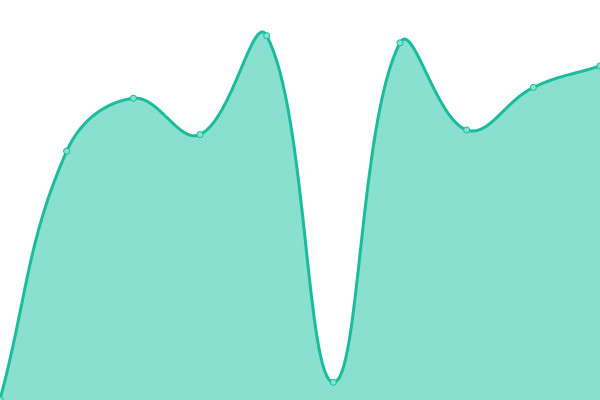
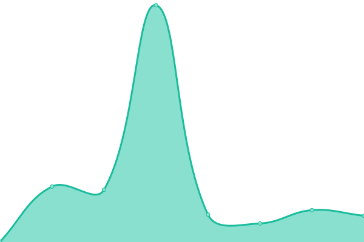

# [📈 Live Status](https://status.sphenhe.me): <!--live status--> **🟧 Partial outage**

This repository contains the open-source uptime monitor and status page for [Jerry](https://status.sphenhe.me), powered by [Upptime](https://github.com/upptime/upptime).

With [Upptime](https://upptime.js.org), you can get your own unlimited and free uptime monitor and status page, powered entirely by a GitHub repository. We use [Issues](https://github.com/SphenHe/upptime/issues) as incident reports, [Actions](https://github.com/SphenHe/upptime/actions) as uptime monitors, and [Pages](https://status.sphenhe.me) for the status page.

<!--start: status pages-->
<!-- This summary is generated by Upptime (https://github.com/upptime/upptime) -->
<!-- Do not edit this manually, your changes will be overwritten -->
<!-- prettier-ignore -->
| URL | Status | History | Response Time | Uptime |
| --- | ------ | ------- | ------------- | ------ |
|  [Blog](https://blog.sphenhe.me) | 🟩 Up | [blog.yml](https://github.com/SphenHe/upptime/commits/HEAD/history/blog.yml) | 

 224ms
     
 | 

<a href="https://status.sphenhe.me/history/blog">100.00%</a>
    

|  [Caddy](https://sphenhe.me) | 🟩 Up | [caddy.yml](https://github.com/SphenHe/upptime/commits/HEAD/history/caddy.yml) | 

 739ms
     
 | 

<a href="https://status.sphenhe.me/history/caddy">100.00%</a>
    

|  Deeplx | 🟩 Up | [deeplx.yml](https://github.com/SphenHe/upptime/commits/HEAD/history/deeplx.yml) | 

 690ms
     
 | 

<a href="https://status.sphenhe.me/history/deeplx">100.00%</a>
    

|  [Fireflyiii](https://money.sphenhe.me) | 🟩 Up | [fireflyiii.yml](https://github.com/SphenHe/upptime/commits/HEAD/history/fireflyiii.yml) | 

 1115ms
     
 | 

<a href="https://status.sphenhe.me/history/fireflyiii">100.00%</a>
    

|  [MonkeyFile](https://monkey.sphenhe.me) | 🟩 Up | [monkey-file.yml](https://github.com/SphenHe/upptime/commits/HEAD/history/monkey-file.yml) | 

 196ms
     
 | 

<a href="https://status.sphenhe.me/history/monkey-file">100.00%</a>
    

|  [Nuclear21Public-Magazine](https://magazine.sphenhe.me) | 🟩 Up | [nuclear21-public-magazine.yml](https://github.com/SphenHe/upptime/commits/HEAD/history/nuclear21-public-magazine.yml) | 

 408ms
     
 | 

<a href="https://status.sphenhe.me/history/nuclear21-public-magazine">90.28%</a>
    

|  [Pastebin](https://pastebin.sphenhe.me) | 🟩 Up | [pastebin.yml](https://github.com/SphenHe/upptime/commits/HEAD/history/pastebin.yml) | 

 292ms
     
 | 

<a href="https://status.sphenhe.me/history/pastebin">100.00%</a>
    

|  [Seafile](https://seafile.sphenhe.me) | 🟥 Down | [seafile.yml](https://github.com/SphenHe/upptime/commits/HEAD/history/seafile.yml) | 

 1004ms
     
 | 

<a href="https://status.sphenhe.me/history/seafile">95.30%</a>
    

|  [TsinghuaMemes](https://memes.sphenhe.me) | 🟩 Up | [tsinghua-memes.yml](https://github.com/SphenHe/upptime/commits/HEAD/history/tsinghua-memes.yml) | 

 337ms
     
 | 

<a href="https://status.sphenhe.me/history/tsinghua-memes">90.95%</a>
    

|  [Vaultwarden](https://vault.sphenhe.me) | 🟩 Up | [vaultwarden.yml](https://github.com/SphenHe/upptime/commits/HEAD/history/vaultwarden.yml) | 

 769ms
     
 | 

<a href="https://status.sphenhe.me/history/vaultwarden">100.00%</a>
    

|  Azure-VPS | 🟩 Up | [azure-vps.yml](https://github.com/SphenHe/upptime/commits/HEAD/history/azure-vps.yml) | 

 149ms
     
 | 

<a href="https://status.sphenhe.me/history/azure-vps">100.00%</a>
    

|  Tsinghua-VPS | 🟩 Up | [tsinghua-vps.yml](https://github.com/SphenHe/upptime/commits/HEAD/history/tsinghua-vps.yml) | 

 260ms
     
 | 

<a href="https://status.sphenhe.me/history/tsinghua-vps">100.00%</a>
    

<!--end: status pages-->

[**Visit our status website →**](https://status.sphenhe.me)

## 📄 License

- Powered by: [Upptime](https://github.com/upptime/upptime)
- Code: [MIT](./LICENSE) © [Anand Chowdhary](https://anandchowdhary.com), supported by [Pabio](https://pabio.com)
- Data in the `./history` directory: [Open Database License](https://opendatacommons.org/licenses/odbl/1-0/)
