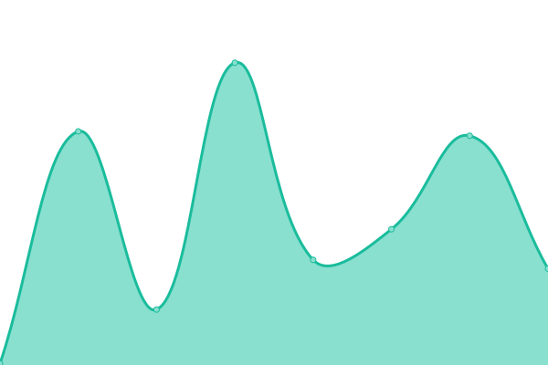
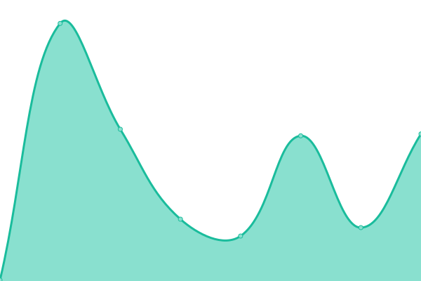

# [📈 Live Status](https://status.sphenhe.me): <!--live status--> **🟧 部分停机**

This repository contains the open-source uptime monitor and status page for [Jerry](https://status.sphenhe.me), powered by [Upptime](https://github.com/upptime/upptime).

With [Upptime](https://upptime.js.org), you can get your own unlimited and free uptime monitor and status page, powered entirely by a GitHub repository. We use [Issues](https://github.com/SphenHe/upptime/issues) as incident reports, [Actions](https://github.com/SphenHe/upptime/actions) as uptime monitors, and [Pages](https://status.sphenhe.me) for the status page.

<!--start: status pages-->
<!-- This summary is generated by Upptime (https://github.com/upptime/upptime) -->
<!-- Do not edit this manually, your changes will be overwritten -->
<!-- prettier-ignore -->
| 链接 | 状态 | 历史 | 响应时间 | 正常运行时间 |
| --- | ------ | ------- | ------------- | ------ |
|  [Status](https://status.sphenhe.me) | 🟥 停机 | [status.yml](https://github.com/SphenHe/upptime/commits/HEAD/history/status.yml) | 

 159毫秒
     
 | 

<a href="https://status.sphenhe.me/history/status">0.00%</a>
    

|  [Blog](https://blog.sphenhe.me) | 🟥 停机 | [blog.yml](https://github.com/SphenHe/upptime/commits/HEAD/history/blog.yml) | 

 111毫秒
     
 | 

<a href="https://status.sphenhe.me/history/blog">0.00%</a>
    

|  [Pastebin](https://pastebin.sphenhe.me) | 🟥 停机 | [pastebin.yml](https://github.com/SphenHe/upptime/commits/HEAD/history/pastebin.yml) | 

 139毫秒
     
 | 

<a href="https://status.sphenhe.me/history/pastebin">0.00%</a>
    

|  [Zoo(deprecated)](https://monkey.sphenhe.me) | 🟩 正常运行 | [zoo-deprecated.yml](https://github.com/SphenHe/upptime/commits/HEAD/history/zoo-deprecated.yml) | 

 477毫秒
     
 | 

<a href="https://status.sphenhe.me/history/zoo-deprecated">100.00%</a>
    

|  Azure Server v4 | 🟥 停机 | [azure-server-v4.yml](https://github.com/SphenHe/upptime/commits/HEAD/history/azure-server-v4.yml) | 

 0毫秒
     
 | 

<a href="https://status.sphenhe.me/history/azure-server-v4">0.00%</a>
    

|  Self Hosted Server v4 | 🟥 停机 | [self-hosted-server-v4.yml](https://github.com/SphenHe/upptime/commits/HEAD/history/self-hosted-server-v4.yml) | 

 0毫秒
     
 | 

<a href="https://status.sphenhe.me/history/self-hosted-server-v4">0.00%</a>
    

|  Self Hosted Server v6 | 🟥 停机 | [self-hosted-server-v6.yml](https://github.com/SphenHe/upptime/commits/HEAD/history/self-hosted-server-v6.yml) | 

 0毫秒
     
 | 

<a href="https://status.sphenhe.me/history/self-hosted-server-v6">0.00%</a>
    

|  [DDNS Dependent Server v4](http://ipv4.icanhazip.com) | 🟩 正常运行 | [ddns-dependent-server-v4.yml](https://github.com/SphenHe/upptime/commits/HEAD/history/ddns-dependent-server-v4.yml) | 

 47毫秒
     
 | 

<a href="https://status.sphenhe.me/history/ddns-dependent-server-v4">100.00%</a>
    

|  [DDNS Dependent Server v6](http://ipv6.icanhazip.com) | 🟥 停机 | [ddns-dependent-server-v6.yml](https://github.com/SphenHe/upptime/commits/HEAD/history/ddns-dependent-server-v6.yml) | 

 0毫秒
     
 | 

<a href="https://status.sphenhe.me/history/ddns-dependent-server-v6">0.00%</a>
    

<!--end: status pages-->

[**Visit our status website →**](https://status.sphenhe.me)

## 📄 License

- Powered by: [Upptime](https://github.com/upptime/upptime)
- Code: [MIT](./LICENSE) © [Anand Chowdhary](https://anandchowdhary.com), supported by [Pabio](https://pabio.com)
- Data in the `./history` directory: [Open Database License](https://opendatacommons.org/licenses/odbl/1-0/)
