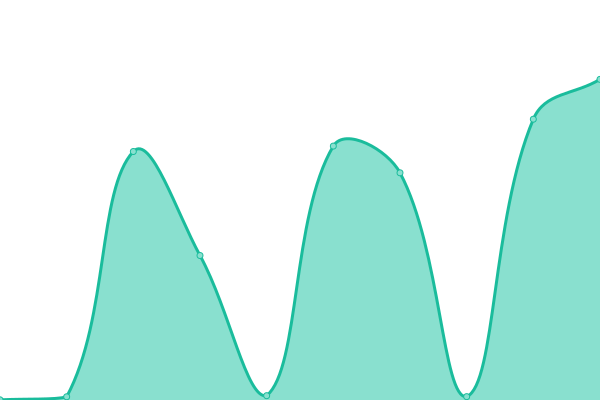
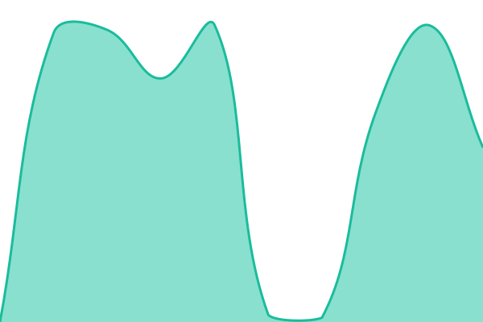
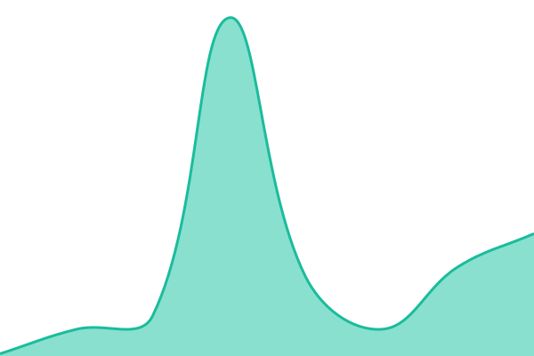

# [📈 Live Status](https://status.sphenhe.me): <!--live status--> **🟧 Partial outage**

This repository contains the open-source uptime monitor and status page for [Jerry](https://status.sphenhe.me), powered by [Upptime](https://github.com/upptime/upptime).

With [Upptime](https://upptime.js.org), you can get your own unlimited and free uptime monitor and status page, powered entirely by a GitHub repository. We use [Issues](https://github.com/SphenHe/upptime/issues) as incident reports, [Actions](https://github.com/SphenHe/upptime/actions) as uptime monitors, and [Pages](https://status.sphenhe.me) for the status page.

<!--start: status pages-->
<!-- This summary is generated by Upptime (https://github.com/upptime/upptime) -->
<!-- Do not edit this manually, your changes will be overwritten -->
<!-- prettier-ignore -->
| URL | Status | History | Response Time | Uptime |
| --- | ------ | ------- | ------------- | ------ |
|  [Service | Caddy](https://sphenhe.me) | 🟩 Up | [service-caddy.yml](https://github.com/SphenHe/upptime/commits/HEAD/history/service-caddy.yml) | 

 738ms
     
 | 

<a href="https://status.sphenhe.me/history/service-caddy">89.19%</a>
    

|  Service | Deeplx | 🟩 Up | [service-deeplx.yml](https://github.com/SphenHe/upptime/commits/HEAD/history/service-deeplx.yml) | 

 529ms
     
 | 

<a href="https://status.sphenhe.me/history/service-deeplx">53.78%</a>
    

|  [Service | HedgeDoc](https://doc.sphenhe.me) | 🟩 Up | [service-hedge-doc.yml](https://github.com/SphenHe/upptime/commits/HEAD/history/service-hedge-doc.yml) | 

 509ms
     
 | 

<a href="https://status.sphenhe.me/history/service-hedge-doc">53.78%</a>
    

|  [Service | Fireflyiii](https://money.sphenhe.me) | 🟩 Up | [service-fireflyiii.yml](https://github.com/SphenHe/upptime/commits/HEAD/history/service-fireflyiii.yml) | 

 778ms
     
 | 

<a href="https://status.sphenhe.me/history/service-fireflyiii">53.78%</a>
    

|  [Service | Pastebin](https://pastebin.sphenhe.me) | 🟩 Up | [service-pastebin.yml](https://github.com/SphenHe/upptime/commits/HEAD/history/service-pastebin.yml) | 

 534ms
     
 | 

<a href="https://status.sphenhe.me/history/service-pastebin">100.00%</a>
    

|  [Service | Seafile](https://seafile.sphenhe.me) | 🟩 Up | [service-seafile.yml](https://github.com/SphenHe/upptime/commits/HEAD/history/service-seafile.yml) | 

 875ms
     
 | 

<a href="https://status.sphenhe.me/history/service-seafile">100.00%</a>
    

|  [Service | Vaultwarden](https://vault.sphenhe.me) | 🟩 Up | [service-vaultwarden.yml](https://github.com/SphenHe/upptime/commits/HEAD/history/service-vaultwarden.yml) | 

 608ms
     
 | 

<a href="https://status.sphenhe.me/history/service-vaultwarden">96.79%</a>
    

|  [Pages | Blog](https://blog.sphenhe.me) | 🟥 Down | [pages-blog.yml](https://github.com/SphenHe/upptime/commits/HEAD/history/pages-blog.yml) | 

 148ms
     
 | 

<a href="https://status.sphenhe.me/history/pages-blog">100.00%</a>
    

|  [Pages | MonkeyFile](https://monkey.sphenhe.me) | 🟩 Up | [pages-monkey-file.yml](https://github.com/SphenHe/upptime/commits/HEAD/history/pages-monkey-file.yml) | 

 354ms
     
 | 

<a href="https://status.sphenhe.me/history/pages-monkey-file">100.00%</a>
    

|  [Pages | Nuclear21Public-Magazine](https://magazine.sphenhe.me) | 🟩 Up | [pages-nuclear21-public-magazine.yml](https://github.com/SphenHe/upptime/commits/HEAD/history/pages-nuclear21-public-magazine.yml) | 

 284ms
     
 | 

<a href="https://status.sphenhe.me/history/pages-nuclear21-public-magazine">100.00%</a>
    

|  [Pages | TsinghuaMemes](https://memes.sphenhe.me) | 🟩 Up | [pages-tsinghua-memes.yml](https://github.com/SphenHe/upptime/commits/HEAD/history/pages-tsinghua-memes.yml) | 

 284ms
     
 | 

<a href="https://status.sphenhe.me/history/pages-tsinghua-memes">100.00%</a>
    

|  Server | Azure-VPS | 🟩 Up | [server-azure-vps.yml](https://github.com/SphenHe/upptime/commits/HEAD/history/server-azure-vps.yml) | 

 132ms
     
 | 

<a href="https://status.sphenhe.me/history/server-azure-vps">98.45%</a>
    

|  Server | Tsinghua-VPS | 🟩 Up | [server-tsinghua-vps.yml](https://github.com/SphenHe/upptime/commits/HEAD/history/server-tsinghua-vps.yml) | 

 250ms
     
 | 

<a href="https://status.sphenhe.me/history/server-tsinghua-vps">54.20%</a>
    

<!--end: status pages-->

[**Visit our status website →**](https://status.sphenhe.me)

## 📄 License

- Powered by: [Upptime](https://github.com/upptime/upptime)
- Code: [MIT](./LICENSE) © [Anand Chowdhary](https://anandchowdhary.com), supported by [Pabio](https://pabio.com)
- Data in the `./history` directory: [Open Database License](https://opendatacommons.org/licenses/odbl/1-0/)
